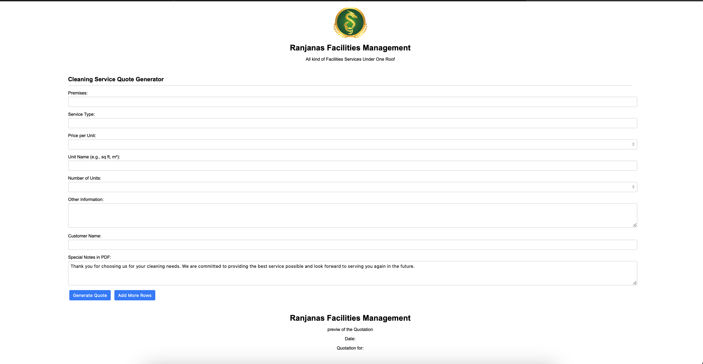

# Quotation Generator Web App

## Overview

This Quotation Generator Web App is designed to help generate professional quotations for Ranjanas Facilities Management. The app allows users to input details like customer information, services provided, pricing, and additional notes. It then generates a formatted quotation that can be printed or saved as a PDF.

## Features

- **Dynamic Row Addition**: Easily add or remove rows for different services or products.
- **Auto Calculation**: Automatically calculates the total for each row and the overall subtotal.
- **Customer Information**: Display customer details prominently at the top of the quotation.
- **Print Functionality**: Print the generated quotation directly from the web app.
- **Save as PDF**: Save the quotation as a PDF with a professional layout.

## Technologies Used

- **HTML/CSS**: For structuring and styling the web app.
- **JavaScript**: For dynamic functionality, including adding/removing rows, calculating totals, and generating PDFs.
- **html2pdf.js**: Library used for converting HTML content into a downloadable PDF.

## Usage

### Installation

1. Clone the repository:
   ```bash
   git clone https://github.com/yourusername/quotation-generator.git
   cd quotation-generator
   ```

2. Open the `index.html` file in your preferred web browser to start using the app.

### How to Use

1. **Input Customer Information**: Enter the customer's name in the designated field. The date will automatically display next to the customer's name.
2. **Add Service Rows**: Use the form fields to enter the details of the service or product, including premises, service type, price per unit, unit name, number of units, and any additional information.
3. **Calculate Totals**: The app will automatically calculate the total cost for each row and the overall subtotal.
4. **Print/Save PDF**: After reviewing the quotation, you can choose to print it directly or save it as a PDF by clicking the respective buttons.

### Example

- **Customer Name**: John Doe
- **Date**: August 10, 2024
- **Service Details**: 
  - Premises: Office A
  - Service Type: Cleaning
  - Price per Unit: Rs. 1500
  - Unit Name: Square Feet
  - Number of Units: 100

### Preview



## Customization

To customize the app:

1. **Logo**: Replace the `logo.png` file with your company’s logo.
2. **Signature**: Replace the `sign.png` file with the signature image for your business.
3. **Address/Contact Information**: Update the address and contact information in the HTML and JavaScript files to reflect your business details.

## Contributing

Contributions are welcome! Feel free to submit a pull request or open an issue.

## License

This project is licensed under the MIT License. See the [LICENSE](LICENSE) file for details.

